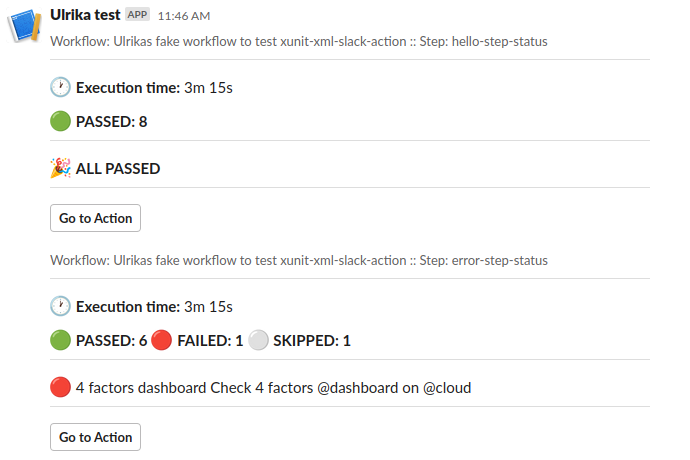
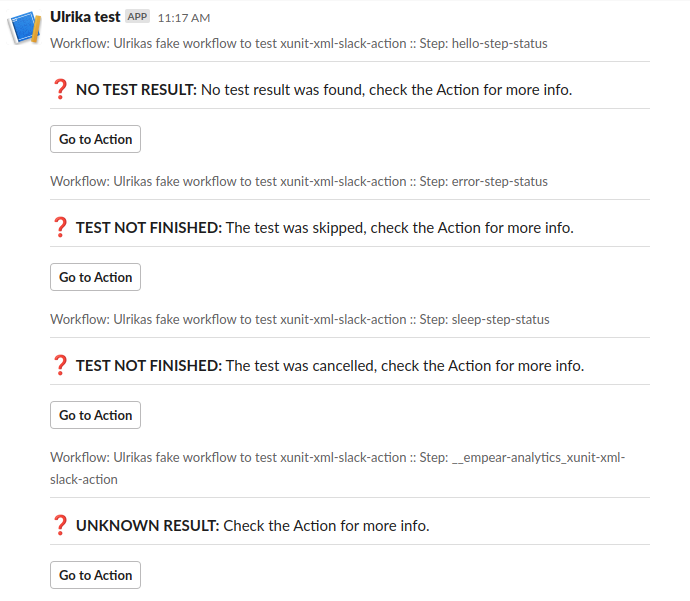

# Sending xUnit report to Slack

This Github Action can be used in a Github Workflow to [report test results into a Slack Channel](https://api.slack.com/messaging/webhooks).

It expects a path to an xUnit-like result file. This file is parsed into a nice message, and posted to a Slack channel. It will also report skipped or cancelled test steps, and missing result files.

## Building

If you make changes, the action needs to be built and the resulting files need to be checked in.

https://docs.github.com/en/actions/creating-actions/creating-a-javascript-action#commit-tag-and-push-your-action-to-github

1. `npm i -g @vercel/ncc` if you didn't already do that
2. `ncc build index.ts --license LICENSE` or `npm run build`
3. commit, push, tag 

## Usage

See [action.yml](action.yml) for parameters.

In the workflow yaml, add a step like this:

```
      - name: My test step
        id: my-test-step
        ...
        
      - name: My reporting step
        id: my-test-report
        if: always()
        uses: empear-analytics/xunit-xml-slack-action@v2
        with:
          test-step-outcome: ${{ steps.my-test-step.outcome }}
          slack-webhook-url: ${{ secrets.MY_SLACK_WEBHOOK_URL }}
          directory-path: test/results.xml
```
- The test step needs an **id** so its outcome can be used in `test-step-outcome`.
- The reporting step should have an **id**, this will then show up in the report. See the examples below: only the last report (UNKNOWN RESULT) has no id for the reporting step. 
- Using `if: always()` for the reporting step is necessary, otherwise it will only report on successful tests.

## Examples

### When there are test results



### Different types of no-result reports




